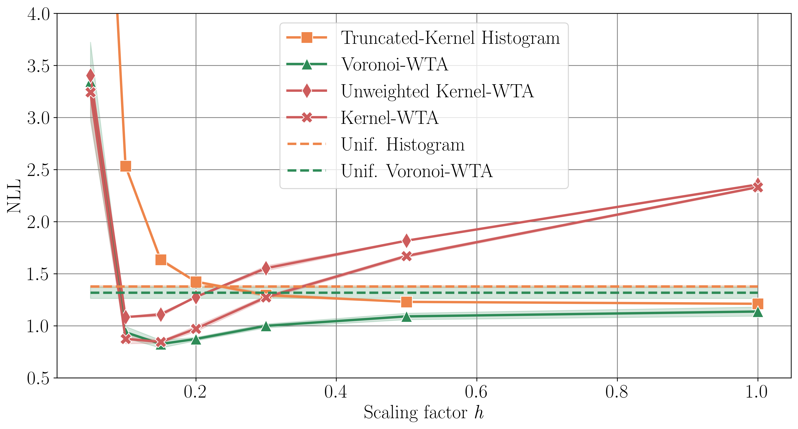

# Official code of *WTA learners are geometry-aware conditional density estimators*

Code for associated with the ICML 2024 publication *Winner-takes-all learners are geometry-aware conditional density estimators* by Victor Letzelter, David Perera, Cédric Rommel, Mathieu Fontaine, Slim Essid, Gaël Richard and Patrick Pérez. 

<div align="center"> <h3> Abstract </h3>  </div>
<div align="justify">

Winner-takes-all training is a simple learning paradigm, which handles ambiguous tasks by predicting a set of plausible hypotheses. Recently, a connection was established between Winner-takes-all training and centroidal Voronoi tessellations, showing that, once trained, hypotheses should quantize optimally the shape of the conditional distribution to predict. However, the best use of these hypotheses for uncertainty quantification is still an open question.
In this work, we show how to leverage the appealing geometric properties of the Winner-takes-all learners for conditional density estimation, without modifying its original training scheme. We theoretically establish the advantages of our novel estimator both in terms of quantization and density estimation, and we demonstrate its competitiveness on synthetic and real-world datasets, including audio data.

</br>

The file structure is organized as follows:
```
.
├── README.md
└── toy # Code-base for synthetic data and UCI datasets experiments.
    └── ...
└── audio # Code-base for audio experiments.
    └── ...
```

## Background

For any machine learning task for which the distribution $p(y|x)$ of the output $y \in \mathcal{Y}$ to be predicted given the input $x \in \mathcal{X}$ may be multimodal, multi-hypotheses models are useful.

For quick overview of score-based Winner-Takes-All based models, please check the README.md of [this](https://github.com/Victorletzelter/code-rMCL) repository (See the figure below) [A].


[A] Letzelter, V., Fontaine, M., Chen, M., Pérez, P., Essid, S., & Richard, G. (2024). Resilient Multiple Choice Learning: A learned scoring scheme with application to audio scene analysis. Advances in neural information processing systems, 36.

## Kernel-based estimators

We are concerned here about turning trained Winner-takes-all models into continuous density estimators, which allows a better quantification of prediction uncertainty (e.g., using the NLL). The estimators studied include *Kernel-WTA*:

$$\rho_{x}(y) = \sum_{k=1}^{K} \gamma_{\theta}^{k}(x) K_h(f_{\theta}^{k}(x),y)$$

and *Voronoi-WTA*:

$$\rho_{x}(y) = \sum_{k=1}^K \gamma_{\theta}^{k}(x) \frac{K_h(f_{\theta}^{k}(x), y)}{V(f_{\theta}^{k}(x), K_h)} \mathbf{1}\left(y \in \mathcal{Y}_{\theta}^{k}(x)\right).$$

where $h \in \mathbb{R}_{+}^{*}$.

## Evaluation of the estimators

Let's say you have given a trained scoring-based WTA model and you want to evaluate the quality of its probabilistic predictions. In real-world tasks, only samples from the target distribution $y_i \sim \rho(y|x)$ are available. A possibility is to evaluate the estimator using the negative log-likelihood (NLL)

$$
\mathrm{NLL} = - \frac{1}{N} \sum_{i=1}^{N} \log \hat{\rho}(y_{i} \mid x_{i}),
$$

where $N$ is the number of samples in the dataset. Thanks to the Kernel-based density estimators of WTA, one can therefore compute the NLL for trained models. It introduces a novel method for the probabilistic evaluation of WTA predictions, even when only a single target from the conditional distribution is available for each input.

## Quick start

1) Install the needed requirements.
```shell
pip install -r requirements.txt
```

2) Select a dataset of interest (see in `toy/config/experiment', e.g., `gauss_not_centered.yaml').

3) Train and test your score-based WTA model.
```shell
cd toy/src ; python train.py experiment=<my_dataset.yaml> model.hparams.kde_mode=<kernel_wta_enabled> --model.hparams.scaling_factor=1.0 test=True
```
Where
- `test` (boolean) indicates whether or not perform the test and the end of the training.
- `model.hparams.kde_mode` (boolean): if True, the estimator *Kernel WTA* is used, otherwise it is *Voronoi WTA*.
- `model.hparams.scaling_factor` (float) indicates the value of $h$ used for evaluation (if model.hparams.h_optimization=False).

Note that by default, the NLL, Risk and MSE are computed, but not the EMD. This can be adjusted with the additionnal flags, e.g., if only the NLL is nedded with `--compute_nll=True --compute_emd=False --compute_risk=False --compute_mse=False`.

If you have a given checkpoint located in `ckpt_path` (str), the same setup applies in evaluation mode
```shell
cd toy/src ; python eval.py data=<my_dataset.yaml> model.hparams.h_optimization=True model.hparams.hmin=0.1 model.hparams.hmax=2.0 model.hparams.h_tol=0.1 mmodel.hparams.batch_size_h_opt=256 model.hparams.limit_val_batches_h_opt=None model.hparams.kde_mode=<kernel_wta_enabled> --model.hparams.scaling_factor=1.0 --compute_nll=True --compute_emd=False --compute_risk=True --compute_mse=True ckpt_path=<your_ckpt_path>
```

Note that the optimization of the scaling factor h at validation time can be performed through the following parameters:

* `model.hparams.h_optimization`: (Default to False) is a boolean: whether the scaling factor $h$ is optimized at validation time or not (if test=True). 
* `model.hparams.h_min`: (Default to 0.1) is a float: lower bound on the optimal scaling factor.   
* `model.hparams.h_max`: 2 is a float: upper bound on the optimal scaling factor.
* `model.hparams.h_tol`: 0.1. Tolerance used in the golden section search algorithm. 
* `model.hparams.batch_size_h_opt`: 256 (integer). Batch size used in the optimization of the scaling factor. 
* `limit_val_batches_h_opt`: None (float). If not none; indicates the proportion of validation batches to use for the optimization of the scaling factor. 
* `model.hparams.kde_mode` (boolean): if True, the estimator *Kernel WTA* is used, otherwise it is *Voronoi WTA*.

Visualisation of the training dynamics is given in Figure A.


*Training dynamic of score-based WTA models*

## Reproducing paper experiments

Note that the following commands involves execution of shell scripts, which may require execution permissions. This execution permission can be set for 
all the scripts in the folder `VoronoiWTA` with

```shell
find . -type f -iname "*.sh" -exec chmod +x {} +
```

### Synthetic datasets

First, the evaluation of our proposed estimators was performed on synthetic data, for which the conditional distribution $p(y \mid x)$ can be assumed to be known.

A visualisation of the synthetic datasets is given in Figure 3.


*Synthetic Datasets Predictions (Figure 2 of the main paper)*

For reproducing the paper experiments, first define your absolute home path as environment variable

```shell
export MY_HOME=<YOUR_PATH>/VoronoiWTA/toy 
```
Where <YOUR_PATH> is your absolute path where the folder VoronoiWTA is stored.

First, the Figure 1 can be reproduced with the command

```shell
cd toy/scripts
./-1script_plot_fig1.sh
```

Where the plot will be saved in `toy/logs/train/plot_figure1/<LAUNCH_TIME>_.../rmcl_preds.png`

To reproduce the quantitative results, launch the following scripts, which are located in `toy/scripts`: 

```shell
cd toy/scripts ; # Change directory
./1scripts_synthetic_train.sh ; # Launch the trainings
```

Once the trainings have finished, the results can be extracted with the following command:

```shell
./2scripts_synthetic_extract_ckpt.sh ; # Extract the checkpoints paths in a json file
```

Finally, launch the evaluations and plot the results

```shell
./3scripts_synthetic_eval_.sh ; # Launch evaluations
./4scripts_synthetic_extract_results.sh ; # Extract the metrics in csv files (in toy/results_saved_csv)
./5scripts_zador_computation.sh ; # Compute the Zador equivalent
./6scripts_plot_figures_std.sh : # Plot the Figures, and save them in toy/figures. 
```

This should provide in particular the Figures 3 and 4 of the main paper (and also the Figures 8-11 of the appendix).


*Quantitative results on the synthetic datasets (Figure 3) of the main paper.*


*Comparison of Kernel-WTA and Voronoi-WTA with respect to sensitivity to the scaling factor (Figure 4).*

### UCI Datasets

Then, the evaluation of our proposed estimators was performed on UCI datasets, for which the conditional distribution $p(y \mid x)$ is not known, as a single sample $y \sim p(y \mid x)$ is available for each input.

The benchmark follows the experimental protocol of preivous works [A,B]. The UCI regression datasets can be downloaded in this [drive](https://drive.google.com/drive/folders/16L5Dy9qw3StCY4AvtP98KA5xDZrtcHV3?usp=drive_link) [C].

Once the datasets are placed in the `toy/data/uci' folder, the results can be reproduced from the following commands. 

```shell
cd toy/scripts_uci ; # Change directory
./1scripts_uci_train_and_eval_loop_protein.sh ; # Perform training and evalution on the Protein dataset
./1scripts_uci_train_and_eval_loop_year.sh ; # Perform training and evalution on the Year dataset
./1scripts_uci_train_and_eval_loop.sh ; # Perform training and evalution on the UCI datasets: "boston" "concrete" "energy" "kin8nm" "naval" "power_plant" "wine" "yacht".
./2scripts_uci_extract_results.sh ; # Extract the metric in csv_files (in toy/results_uci).
```

[A] Hernandez-Lobato, J. M. and Adams, R. Probabilistic back-propagation for scalable learning of bayesian neural networks. In ICML, pp. 1861–1869. PMLR, 2015.

[B] Lakshminarayanan, B., Pritzel, A., and Blundell, C. Simple and scalable predictive uncertainty estimation using deep
ensembles. In NeurIPS, volume 30, 2017.

[C] Han, X., Zheng, H., & Zhou, M. Card: Classification and regression diffusion models. In NeurIPS, volume 35, 2022. 

### Audio experiments

For reproducing the experiments on audio data, the reader is invited to check the `audio` folder, where the following scripts can be executed. The evaluation was performed on the ANSYN dataset as proposed by [A].

For reproducing the results, first define the environment variable with:

```shell
export MY_HOME=<YOUR_PATH>/VoronoiWTA/audio
```

The following shell scripts can be executed for downloading, pre-processing the data:

```shell
cd audio/scripts/official_pipeline ;
./1download_data.sh ; # script to download the dataset
./2preprocessing.sh ; # preprocess the raw audio data by computing spectrograms.
```

The checkpoints of the pre-trained models are available at this [link](https://drive.google.com/drive/folders/1e_8416YI922VELQ0-2oWYgondZdy0DMu?usp=sharing). 
Once downloaded, place the the content of the `checkpoints` folder in the root of the repo and run the following command:

```shell
mkdir -p audio/log/train/ansim
mv checkpoints/* audio/log/train/ansim/  
```

For re-training the models, please launch the following script:

```shell
./3train.sh ; # script to launch the trainings of the different baselines
```

When lauching the trainings, the logs will be written in the directory `audio/logs/train/ansim`.

For extracting the checkpoint paths in a JSON file:

```shell
PATH_HISTOGRAM=${MY_HOME}/logs/train/ansim/Histogram # PATH to Histogram results folders.
PATH_WTA=${MY_HOME}/logs/train/ansim/Score_based_WTA # PATH to Score-based WTA results folders.
PATH_MDN=${MY_HOME}/logs/train/ansim/Von_Mises_Fisher # PATH to MDN results folder.
./4extract_ckpt.sh histogram $PATH_HISTOGRAM score_based_wta $PATH_WTA mdn $PATH_MDN
```

The JSON file will be saved it `$PATH_HISTOGRAM/../checkpoints.json`.
For the next, make sure `jq` is installed or install it with `sudo apt-get install jq`.

Perform the evaluation

```
./5eval.sh ; # script to launch the evaluation of the different baselines.
```

Then, the results can be extracted with the following commands. 

```
./6extract_results.sh ; # script to extract results from the different baselines.
./7plot_results.sh # script to plot curves.
```

[A] Adavanne, S., Politis, A., Nikunen, J., & Virtanen, T. (2018). Sound event localization and detection of overlapping sources using convolutional recurrent neural networks. IEEE Journal of Selected Topics in Signal Processing, 13(1), 34-48.

### Related repositories

Note that we used the following [Lightning Hydra Template](https://github.com/ashleve/lightning-hydra-template) template for our experiments, that we strongly encourage to use as well.

Our code was also inspired from the following repositories: 

[A] [Resilient Multiple Choice Learning](https://github.com/Victorletzelter/code-rMCL)

[B] [Pilot](https://github.com/rub-ksv/pilot)

[C] [Multimodal Future Prediction](https://github.com/lmb-freiburg/Multimodal-Future-Prediction)

[D] [Compactified Voronoi Density Estimator](https://github.com/vlpolyansky/cvde)

[E] [CARD](https://github.com/XzwHan/CARD)

[F] [Seld Net](https://github.com/sharathadavanne/seld-net)

### Contribution

This code could be better organized and made more computationally efficient. Feel free to contribute to this repository or report any difficulties or bugs.

### Citation 

If our work helped in your research, please consider citing us with the following bibtex code:

```
@inproceedings{letzelter2024winner,
  title={Winner-takes-all learners are geometry-aware conditional density estimators},
  author={Letzelter, Victor and Perera, David and Rommel, C{\'e}dric and Fontaine, Mathieu and Essid, Slim and Richard, Gael and P{\'e}rez, Patrick},
  booktitle={International Conference on Machine Learning},
  year={2024}
}
```
